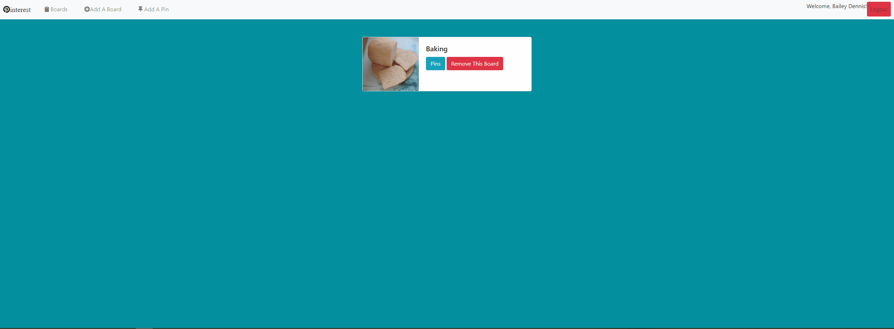
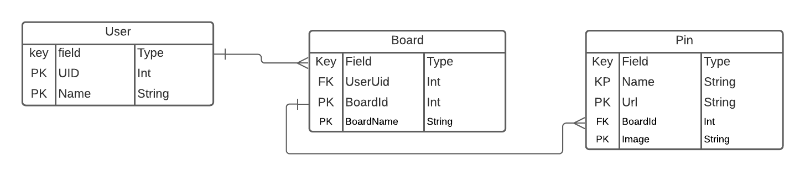

### Pinterest


## Motivation
This project was created to learn about firebase and sending / reciving data between a site and a remote API. We also used OAuth functionality to have users log in, and learned about CRUD functionality. The project is a basic copy of Pinterest, hence the project's name. 

## Technology Used
Javascript, Sass, Google Firebase, NodeJS, JQuery, bootstrap

## Deployment
Coming Soon!

## Code Snippet

``` javascript
import firebase from 'firebase/app';
import 'firebase/auth';

const signMeIn = () => {
  const provider = new firebase.auth.GoogleAuthProvider();
  firebase.auth().signInWithPopup(provider);
};

const loginButton = () => {
  const domString = `<div id="auth">
                      <span style="font-size: 5em; color: Tomato;"><i class="fab fa-pinterest-p"></i></span>
                      <h4>Welcome to Pintrest</h4>
                      <button id="google-auth" class="btn btn-primary btn-lg">
                        <i class="fab fa-google"></i></i>oogle Login
                      </button>
                    </div>`;

  $('#app').html(domString);
  $('#google-auth').on('click', signMeIn);
};

export default { loginButton };
```

## Entity Relationship Diagram

